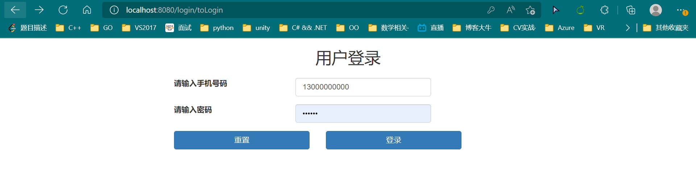
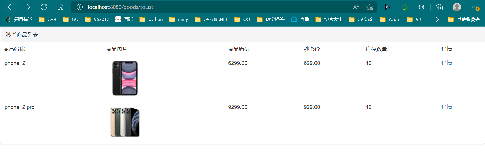
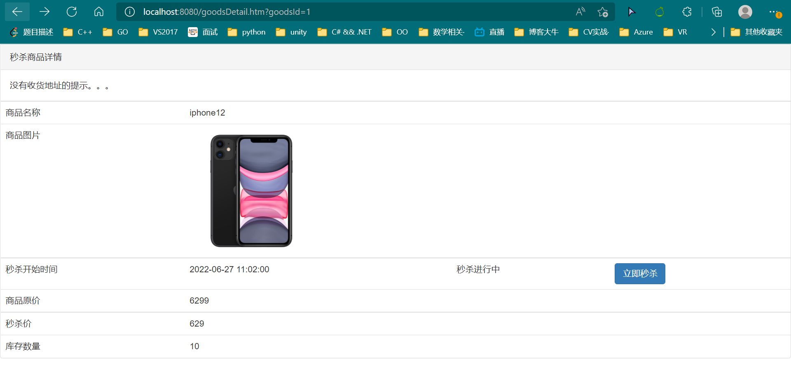
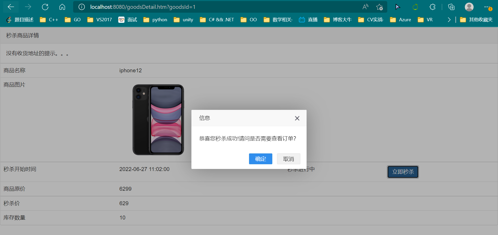
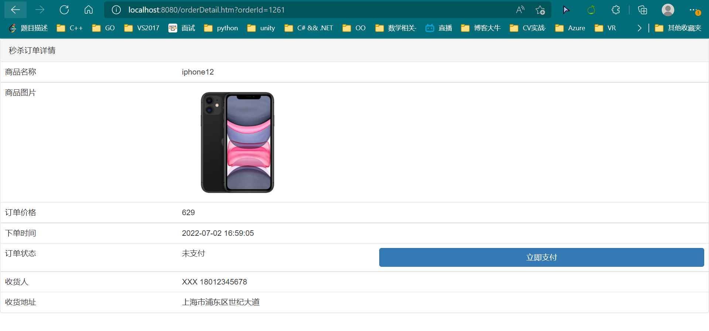

# 秒杀项目

## 介绍

本项目主要针对秒杀的场景进行的开发工作，其中包含用户登陆、商品的功能模块、系统压测、安全优化等模块。完成了后台代码的编写，解决了用户下单、支付、超买和超卖等问题。

## 具体内容

1. 项目框架搭建
   1. SpringBoot环境搭建
   2. 集成Thymeleaf,RespBean
   3. MyBatis
2. 分布式会话
   1. 用户登录
      1. 设计数据库
      2. 明文密码二次MD5加密
      3. 参数校验+全局异常处理
   2. 共享Session
      1. SpringSession
      2. Redis
3. 功能开发
   1. 商品列表
   2. 商品详情
   3. 秒杀
   4. 订单详情
4. 系统压测
   1. JMeter
   2. 自定义变量模拟多用户
   3. JMeter命令行的使用
   4. 正式压测
      1. 商品列表
      2. 秒杀
5. 页面优化
   1. 页面缓存+URL缓存+对象缓存
   2. 页面静态化，前后端分离
   3. 静态资源优化
   4. CDN优化
6. 接口优化
   1. Redis预减库存减少数据库的访问
   2. 内存标记减少Redis的访问
   3. RabbitMQ异步下单
      1. SpringBoot整合RabbitMQ
      2. 交换机
7. 安全优化
   1. 秒杀接口地址隐藏
   2. 算术验证码
   3. 接口防刷
8. 主流的秒杀方案

## 软件架构

|                         技术                          | 版本  |                            说明                            |
| :---------------------------------------------------: | :---: | :--------------------------------------------------------: |
|                      Spring Boot                      | 2.6.4 |                                                            |
|                         MySQL                         |   8   |                                                            |
| MyBatis Plus | 3.5.1 |                                                            |
|                       Swagger2                        | 2.9.2 |        Swagger-models2.9.2版本报错，使用的是1.5.22         |
|         Kinfe4j          | 2.0.9 | 感觉比Swagger UI漂亮的一个工具，访问地址是ip:端口/doc.html |
|                   Spring Boot Redis                   |       |                                                            |

## 使用说明

登录页面：http://kanghaiquan.top:8080/login/toLogin

账号密码: 1300000000/123456

## 运行效果展示

